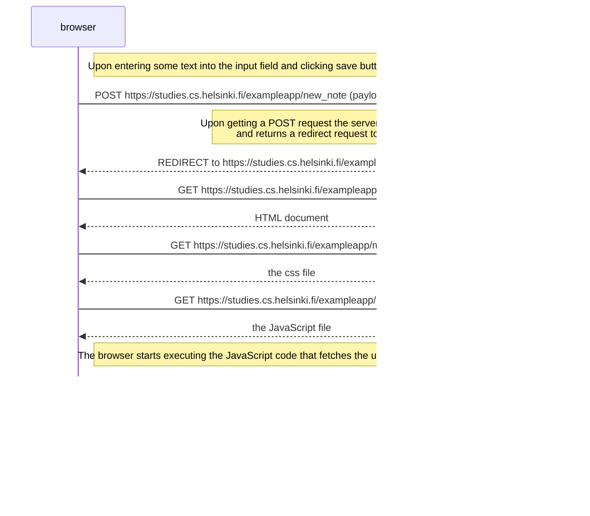

```mermaid
sequenceDiagram
    participant browser
    participant server

    Note right of browser: Upon entering some text into the input field and clicking save button
    browser->>server: POST https://studies.cs.helsinki.fi/exampleapp/new_note (payload: some new note here)
    activate server 
    Note left of server: Upon getting a POST request the server saves the note to database <br/> and returns a redirect request to /exampleapp/notes
    server-->>browser: REDIRECT to https://studies.cs.helsinki.fi/exampleapp/notes
    deactivate server

    browser->>server: GET https://studies.cs.helsinki.fi/exampleapp/notes
    activate server
    server-->>browser: HTML document
    deactivate server

    browser->>server: GET https://studies.cs.helsinki.fi/exampleapp/main.css
    activate server
    server-->>browser: the css file
    deactivate server

    browser->>server: GET https://studies.cs.helsinki.fi/exampleapp/main.js
    activate server
    server-->>browser: the JavaScript file
    deactivate server

    Note right of browser: The browser starts executing the JavaScript code that fetches the updated JSON from the server
browser->>server: GET https://studies.cs.helsinki.fi/exampleapp/data.json
    activate server
    server-->>browser: [{ "content": "some new note here", "date": "2024-1-23" }, ... ]
    deactivate server

    Note right of browser: The browser executes the callback function that renders the notes
    

    
```
